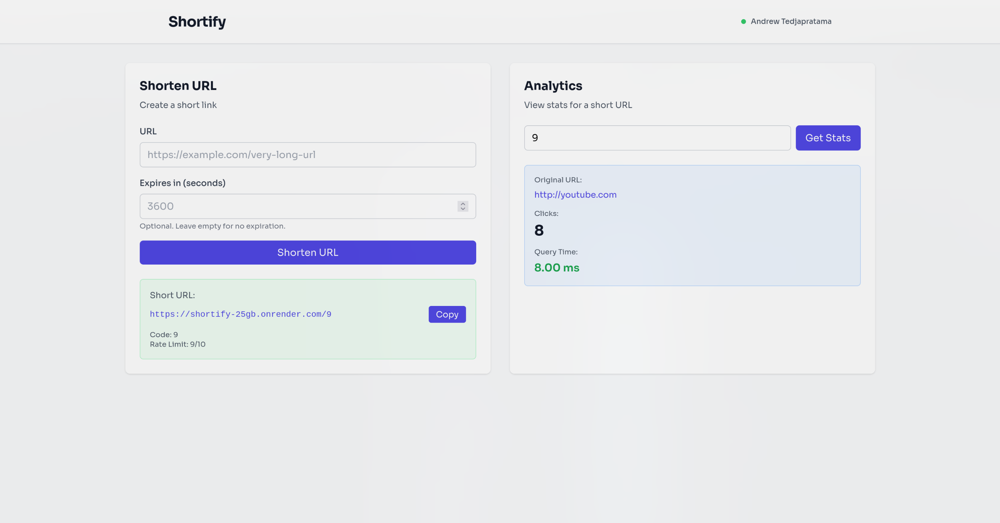

# Shortify

> A Redis-backed URL shortener focused on rate limiting, atomic operations, and real-world deployment trade-offs, with fetch time benchmarking.

[](https://bun.sh)
[](https://hono.dev)
[](https://upstash.com)
[](https://react.dev)
[](https://typescriptlang.org)
[](https://shortify-25gb.onrender.com)

**Live Demo:** [https://shortify-app-alpha.vercel.app/](https://shortify-app-alpha.vercel.app/)
**API Endpoint:** [https://shortify-25gb.onrender.com](https://shortify-25gb.onrender.com/api/health)

---

<div align="center">
  
</div>

---

## Features

### Core

- Short URLs via Base62 encoding
- Click counting with atomic increments
- Optional expiration (5 min → 7 days)
- Basic analytics (clicks + fetch latency)

### Technical

- Sliding-window rate limiting using Redis ZSETs (10 req/min per IP)
- Atomic counters with `INCR` / `ZADD`
- TTL-based expiry without cascading deletes
- Parallel Redis reads with `Promise.all`
- Latency logging for Redis operations
- Serverless Redis via Upstash
- Deployed end-to-end (Render + Vercel, free tier)

---

## Project Structure

```
shortify/
├── app/
│   ├── index.ts              # Main API routes (Hono app)
│   └── utils.ts              # Base62 encoding utilities
├── frontend/
│   ├── src/
│   │   ├── components/
│   │   │   ├── Landing.tsx   # Landing page component
│   │   │   ├── MainApp.tsx   # URL shortener interface
│   │   │   └── navbar.tsx    # Navigation bar
│   │   ├── App.tsx           # React Router setup
│   │   └── index.css         # Tailwind + custom styles
│   ├── package.json
│   └── vite.config.ts        # Vite configuration
├── server.ts                 # Bun server entry point
├── package.json              # Backend dependencies
├── .env.example              # Environment variable template
└── README.md
```

---

## Key Implementation Details

### 1. Sliding Window Rate Limiting

Uses Redis sorted sets (`ZSET`) to track request timestamps:

```typescript
// Remove old timestamps outside the 60-second window
await redis.zremrangebyscore(rateLimitKey, 0, windowStart);

// Count requests in current window
const currentCount = await redis.zcard(rateLimitKey);

// Add current request timestamp
await redis.zadd(rateLimitKey, { score: now, member: now.toString() });
```

**Why not simple INCR + EXPIRE?** Fixed-window counters have edge cases where users can make 2x requests at window boundaries. Sliding window provides precise rate limiting.

### 2. Base62 Encoding

Converts numeric IDs to URL-safe short codes:

```typescript
const BASE62_CHARS =
	"0123456789abcdefghijklmnopqrstuvwxyzABCDEFGHIJKLMNOPQRSTUVWXYZ";

// ID 1 → "1", ID 62 → "10", ID 3844 → "100"
function toBase62(num: number): string {
	// ... implementation
}
```

**Why Base62 over Base64?** Base64 uses `+` and `/` which need URL encoding. Base62 is URL-safe by default.

### 3. TTL Without Cascading Deletes

Redis doesn't auto-delete related keys, so we manually set TTL on both:

```typescript
await redis.set(`url:${shortCode}`, url);
await redis.set(`url:${shortCode}:clicks`, "0");

// Set expiration on BOTH keys
await redis.expire(`url:${shortCode}`, expiresIn);
await redis.expire(`url:${shortCode}:clicks`, expiresIn);
```

### 4. Parallel Redis Queries

Fetch URL and click count simultaneously:

```typescript
const [url, clicks] = await Promise.all([
	redis.get<string>(`url:${code}`),
	redis.get<string>(`url:${code}:clicks`),
]);
```

---

## Performance Notes

Observed latency varies by environment:

### Local (Bun + Redis)

- Redis `GET`: ~5–10ms
- Atomic ops (`INCR`, `ZADD`): ~10–15ms

### Production (Render + Upstash)

- Average request latency: ~50–70ms
- Occasional spikes due to cold starts on Render free tier

### Comparison

- External API: ~250ms+

The higher production latency is expected due to:

- Network round-trips (Render <-> Upstash)
- Free-tier CPU throttle
- Cold start behavior

Despite this, using Redis remains significantly faster and more consistent than external APIs in real-world usage.

---

**Resources:**

- [Redis Command Reference](https://redis.io/commands/)
- [Upstash Documentation](https://docs.upstash.com/redis)
- [Hono Documentation](https://hono.dev)
- [Bun Documentation](https://bun.sh/docs)
- [Bun Redis Docs](https://bun.com/docs/runtime/redis)
- [Docker compose Docs](https://docs.docker.com/compose/)
